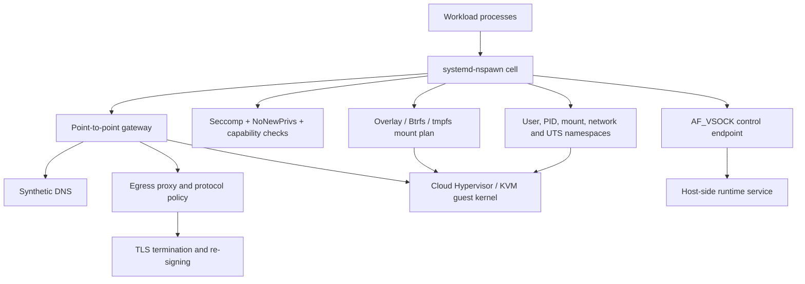
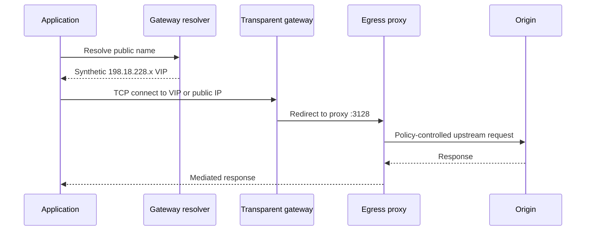
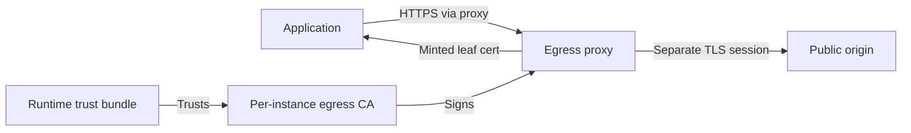

# Inside the Sandbox

## A boundary, resource-accounting, storage, and egress whitepaper

**Assessment date:** 29 September 2026
**Provenance:** single instance, single session — all measurements from one workload cell on the date above.  
**Platform observed:** Ubuntu 24.04.5 LTS, Linux 7.0.0-38-generic, x86_64  
**Assessment style:** non-invasive, black-box diagnostics from inside the workload environment

> **Central finding:** This is not a conventional unrestricted virtual machine. It is a layered runtime: a Cloud Hypervisor/KVM guest contains a systemd-nspawn workload cell whose root user is remapped through a user namespace. Filesystem overlays, capability rules, seccomp filters, read-only bind mounts, synthetic DNS, transparent traffic redirection, and TLS re-signing create separate control planes. `uid 0` is useful inside the cell, but it is not host root and does not imply direct device, kernel, network, or host-service access.

> [!IMPORTANT]
> **Novel Observations (What's New Beyond Meta's Published Architecture):**
> 1. **Synthetic DNS VIP Allocation:** RFC 2544 benchmark supernet (`198.18.0.0/15`) dynamically mapped to external hosts, returning `NOERROR` even for non-existent domains.
> 2. **Egress CA Certificate Details:** On-the-fly TLS inspection and re-signing verified via locally installed per-instance egress CA trust anchors.
> 3. **AF_VSOCK Hypervisor Channel:** Confirmed connectivity to CID 2 (the hypervisor host) on port 512, identifying the narrow guest-host boundary.
> 4. **Transparent Compression Accounting:** 2 GB of zeroes written to `/var/cache/apt/archives` consumed only ~58 MB of physical storage, verifying Btrfs `compress-force=zstd:3` overmount behavior.
> 5. **Observed Sentinel Interception:** Empirical capture of real-time stream scrubbing and transcript excision when credentials were leaked during diagnostics, forcing an immediate out-of-band agent re-steering.
>
> *For context against prior teardowns, host hardware analyses, and official disclosures, see the [Related Work](../README.md#related-work) section in the root repository.*

---

## Table of contents

1. [Executive summary](#executive-summary)
2. [Scope, method, and confidence](#scope-method-and-confidence)
3. [Architecture at a glance](#architecture-at-a-glance)
4. [Compute, virtualization, and identity](#compute-virtualization-and-identity)
5. [Privilege and syscall confinement](#privilege-and-syscall-confinement)
6. [Storage architecture and persistence](#storage-architecture-and-persistence)
7. [Memory accounting](#memory-accounting)
8. [Network, DNS, and egress mediation](#network-dns-and-egress-mediation)
9. [TLS interception and trust](#tls-interception-and-trust)
10. [Host interfaces, processes, and time](#host-interfaces-processes-and-time)
11. [Observed resource limits](#observed-resource-limits)
12. [Security interpretation](#security-interpretation)
13. [Most restrictive boundaries](#most-restrictive-boundaries)
14. [Unexpected behavior](#unexpected-behavior)
15. [Open questions](#open-questions)
16. [Reproduction guide](#reproduction-guide)
17. [Conclusion](#conclusion)

---

## Executive summary

The environment exposes a deliberately broad Linux userland while retaining strong boundaries around the host and the network. The result is a sandbox that feels permissive for ordinary engineering work but behaves very differently from a general-purpose VPS at the points where privilege would otherwise cross a trust boundary.

| Layer | Direct observation | Interpretation |
|---|---|---|
| Hardware | Cloud Hypervisor DMI; KVM CPU flags | Hardware VM boundary |
| Container | `systemd-nspawn` detected | Workload cell inside guest |
| Identity | UID/GID `0 -> 131072` | Root is user-namespaced |
| Syscalls | seccomp mode 2; four filters | Selected calls filtered |
| Filesystem | overlay root; Btrfs home; tmpfs scratch | Mixed durability and quotas |
| Network | point-to-point gateway; traffic redirected | No direct Internet path observed |
| DNS | public names mapped to benchmark-range VIPs | Synthetic service discovery |
| HTTPS | certificates signed by local egress CA | TLS inspection and re-signing |
| Host channel | AF_VSOCK connect to CID 2, port 512 | Narrow hypervisor-mediated path |
| Time | shared time namespace; TSC active | No observed clock offset isolation |

The strongest practical conclusions are:

- **Root is scoped.** The process runs as uid 0 in the container, but uid 0 maps to host uid 131072. It can read `/etc/shadow`, write much of the overlay, bind local ports, and trace its own child processes. It still cannot read the kernel log, access hidden block devices, or escape policy through direct sockets.
- **Outbound traffic is mediated.** Explicit proxy traffic works. Attempts to bypass proxy variables are redirected to the gateway. DNS answers are synthetic, including for nonexistent names. Successful TCP connection results therefore do not prove origin reachability.
- **HTTPS is inspected.** The proxy presents leaf certificates signed by a locally trusted, per-instance egress certificate authority (CA). The application sees a valid chain because the runtime installs the corresponding trust anchor.
- **Memory views have different scopes.** `/proc/meminfo` reports roughly 7.75 GiB of guest-wide memory, while `ps` sees only the container's processes. With no delegated memory cgroup controller, most apparent usage cannot be attributed from inside the workload.
- **Storage is intentionally heterogeneous.** `/` is a small writable overlay, `/home/hatch` is a large Btrfs-backed mount, `/tmp` and `/var/tmp` are bounded memory filesystems, and runtime assets are selectively read-only or masked.

These results characterize one running instance at one point in time. They do not prove behavior across every host, policy revision, or lifecycle reset.

---

## Scope, method, and confidence

Four diagnostic passes were performed on 29 September 2026. They covered identity, namespaces, capabilities, resources, mounts, persistence markers, process visibility, network routing, DNS, TLS, selected syscalls, a virtual-socket endpoint, and clock topology. Probes were bounded and non-destructive: temporary files were deleted, local test processes were reaped, no cgroup files were written, no `/run/hatch` socket was contacted during the socket inventory, and no privilege escalation or sandbox escape was attempted.

### Evidence labels

This paper uses three confidence labels:

- **FACT:** directly present in command output or reproduced by a bounded test.
- **INFERENCE:** the best explanation consistent with multiple observations, but not directly exposed by the runtime.
- **NOT DETERMINABLE:** the necessary lifecycle transition, host-side view, device node, or accounting interface was unavailable.

### Important limits

1. **The assessment is inside-out.** Host configuration, hypervisor policy, and physical storage topology were not inspected from the host.
2. **Connection success is not endpoint success.** A transparent middlebox can accept a TCP handshake while preventing the requested protocol or destination.
3. **Invalid-argument syscall tests are classification probes.** An `EINVAL`, `EFAULT`, or `EACCES` result shows that a syscall was not rejected with the tested seccomp signature; it does not prove that a valid privileged operation would succeed.
4. **Persistence was checked during one boot.** Marker files survived new shells and later probes, but PID 1 had the same start time. Cross-reset durability remains untested.
5. **Memory numbers are snapshots.** They varied between passes and combine guest-wide counters with namespace-scoped process visibility.

### Evidence set

| Probe | Time window | Primary purpose |
|---|---:|---|
| Boundary probe | ~05:00 UTC | Baseline identity, resources, mounts, network |
| Gap probe | ~06:00 UTC | Namespaces, direct-path tests, TLS, memory |
| Telemetry audit | 06:38 UTC | VSOCK, syscall matrix, ports, clocks |
| Gap closure | 06:43 UTC | Marker recheck, CA detail, Host/SNI behavior |

Secrets, proxy credentials, runtime tokens, session identifiers, instance identifiers, and the assigned fully qualified domain name are intentionally omitted.

---

## Architecture at a glance



This is a defense-in-depth design. The relevant boundary is not just "the VM." The workload is constrained again inside the guest by identity remapping, namespace isolation, syscall filtering, mount composition, inaccessible device nodes, and mediated connectivity.

A useful mental model is:

```text
application root
  -> container namespace root
     -> remapped host identity
        -> guest-kernel policy
           -> hypervisor boundary
              -> controlled host services and egress
```

Each arrow represents a separate policy decision. Passing one layer does not imply authority at the next.

---

## Compute, virtualization, and identity

### The workload sits inside both a hardware VM and a container

**FACT:** DMI identifies the system vendor and product as Cloud Hypervisor. `lscpu` reports KVM as the hypervisor vendor and full virtualization. `systemd-detect-virt` reports `systemd-nspawn`, showing an additional container boundary inside the guest.

| Property | Observed value |
|---|---|
| Guest OS | Ubuntu 24.04.5 LTS |
| Kernel | 7.0.0-38-generic |
| Architecture | x86_64 |
| Virtualization | Cloud Hypervisor on KVM |
| Container runtime | systemd-nspawn |
| vCPU count | 2 |
| CPU model exposed | AMD EPYC 9D25 |
| Guest-visible RAM | 8,126,308 kB |
| Swap | 0 |

DMI intentionally exposes only a minimal platform identity: `cloud-hypervisor`, BIOS version `0`, and no useful physical board inventory.

### Root is remapped, not host-root

**FACT:** The namespace maps were:

```text
/proc/self/uid_map: 0 131072 65536
/proc/self/gid_map: 0 131072 65536
```

Container uid 0 therefore maps to host uid 131072, with a 65,536-ID range. The process has private user, PID, mount, network, IPC, UTS, and cgroup namespaces. The time namespace is shared.

**Interpretation:** This explains why operations that depend only on container-local ownership succeed while operations requiring authority in the initial user namespace fail. The label `root` is accurate inside the cell but incomplete as a statement of platform privilege.

### Process visibility is namespace-scoped

The visible process tree contained systemd as PID 1, journald, the runtime daemon, an execution daemon, and probe descendants. The runtime daemon used roughly 0.52 GiB RSS in the measured snapshot and dominated visible process memory. Some injected runtime processes appeared with parent PID 0, while the PID namespace link that was readable matched PID 1 and the probing shell.

**INFERENCE:** Processes with PPID 0 are attached at the namespace boundary rather than being ordinary descendants of PID 1. The exact host-side ancestry is not visible.

---

## Privilege and syscall confinement

### Container root is operationally capable

The following actions succeeded:

- reading `/etc/shadow`;
- writing test files under `/`, `/etc`, `/usr`, `/home`, `/mnt`, and `/tmp`;
- `sudo -n true` (unsurprising because the process was already uid 0);
- creating a localhost listener and receiving an HTTP request;
- tracing a child process with `strace`;
- spawning and reaping 100 short-lived processes;
- keeping a process alive for 60 seconds;
- allocating and deleting a 500 MB temporary file.

No file capabilities were found by the bounded `getcap` scan. The effective and bounding capability masks contained most Linux capabilities but excluded `CAP_SYS_PTRACE`. The ambient capability set was empty.

### Three independent mechanisms narrow that privilege

| Mechanism | Observation | Practical effect |
|---|---|---|
| User namespace | uid 0 maps to 131072 | No initial-namespace root |
| NoNewPrivs | `NoNewPrivs: 1` | Exec cannot gain new privilege |
| Seccomp | mode 2, four filters | Selected syscalls return EPERM |
| Kernel sysctl | `dmesg_restrict=1` | Kernel log requires stronger authority |
| Yama | `ptrace_scope=1` | Cross-process tracing restricted |
| Mount policy | `/sys` and many runtime paths read-only | Kernel/runtime state not writable |

`/proc/self/attr/current` reported `unconfined`. The securityfs files that normally enumerate Linux Security Modules and lockdown state were not mounted, so the absence of an AppArmor label does not prove the absence of other host-side enforcement.

### Why `dmesg` fails despite uid 0

**FACT:** `dmesg` returned `Operation not permitted`, and `kernel.dmesg_restrict` was `1`.

**INFERENCE:** The kernel requires `CAP_SYSLOG` in the initial user namespace. A capability held only in the container's user namespace does not satisfy that check. Seccomp and `NoNewPrivs` add confinement, but the direct evidence most closely matches the `dmesg_restrict` gate.

### Syscall action profile

The audit invoked selected x86_64 syscalls with deliberately invalid arguments and classified the immediate errno.

| Syscall | Observed errno | What the result establishes |
|---|---:|---|
| `bpf` | `EINVAL` | Reached argument validation |
| `userfaultfd` | `EPERM` | Blocked or permission-gated |
| `perf_event_open` | `EACCES` | Reached permission checks |
| `pivot_root` | `EFAULT` | Reached argument validation |
| `kexec_load` | `EPERM` | Blocked or permission-gated |
| `io_uring_setup` | `EPERM` | Blocked or permission-gated |
| `landlock_create_ruleset` | `EFAULT` | Reached argument validation |

The original probe labeled EPERM results as filtered because seccomp mode 2 was active. More precisely, **EPERM alone cannot distinguish seccomp from a capability or policy denial** without tracing the active filter or comparing against a controlled baseline. The test does show that these operations are not available through the supplied call pattern.

`strace` of a child process succeeded even without `CAP_SYS_PTRACE`. That is expected: a process can trace its own child under `PTRACE_TRACEME`-style relationships without possessing the capability needed to attach arbitrarily.

---

## Storage architecture and persistence

### The mount plan separates mutable, durable, temporary, and trusted content

| Path | Filesystem | Size observed | Access | Intended character |
|---|---|---:|---|---|
| `/` | overlayfs | 7.5 GiB | Read-write | Small mutable root |
| `/home/hatch` | Btrfs | 100 GiB | Read-write | Large durable workspace |
| `/tmp` | tmpfs | 512 MiB effective | Read-write | Ephemeral scratch |
| `/var/tmp` | tmpfs | 2.0 GiB | Read-write | Larger ephemeral scratch |
| `/dev/shm` | tmpfs | 794 MiB | Read-write | Shared memory |
| `/run` | tmpfs | 1.6 GiB | Mixed submounts | Runtime state |
| `/opt/hatch` | SquashFS | N/A | Read-only | Runtime tools/assets |
| `/etc/hosts` | SquashFS bind | N/A | Read-only | Managed network config |
| `/etc/resolv.conf` | SquashFS bind | N/A | Read-only | Managed resolver config |
| `/sys` | filtered sysfs/tmpfs | 4 MiB wrapper | Read-only | Restricted kernel view |

Two tmpfs layers were visible at `/tmp`; the inner 512 MiB mount is effective. A 500 MB allocation succeeded and left roughly 12 MB free, validating the effective limit.

### `/` is disk-backed, not RAM-backed

**FACT:** The root filesystem is overlayfs with a lower directory and an upper/work directory described by the mount table. A bounded test wrote ten 200 MB zero-filled chunks, up to 2 GB, to `/var/probe-fill` and then deleted the file. During the test:

- free space reported for `/run` stayed constant;
- `MemAvailable` did not fall with file growth;
- free space on `/` changed by only about 58 MB;
- deleting the file restored most reported root capacity.

**INFERENCE:** The overlay upper layer is backed by storage outside the visible `/run` tmpfs accounting. It is not RAM-backed. The small physical-space change for 2 GB of zeros is consistent with transparent compression or sparse/block-level optimization, but the exact implementation was not exposed.

### The named block layer is visible only through mounts

Mount metadata names `/dev/mapper/rv` as the Btrfs source for `/home/hatch` and selected persistent runtime paths. It names `/dev/mapper/opt_hatch` as the SquashFS source for runtime assets and managed configuration.

However:

- no `/dev/mapper/*` nodes were exposed;
- `/dev/disk/by-*` was absent;
- `dmsetup`, `btrfs`, and `unsquashfs` were unavailable;
- the attempted discard dry run was unsupported by the installed `blkdiscard`.

**NOT DETERMINABLE:** Whether those mapper names correspond to linear device-mapper targets, encryption, loop devices, or another host-side abstraction cannot be established from this namespace.

### Persistence was demonstrated only within the same boot

Five marker files were written under `/home/hatch`, `/root`, `/var/tmp`, `/etc`, and `/tmp`. A later probe found all five with identical SHA-256 hashes. PID 1 still had the same start time and approximately 4 hours 49 minutes of uptime.

**FACT:** All five locations persisted across separate shell executions during one boot.  
**NOT DETERMINABLE:** Which locations survive a workload reset, container restart, VM reboot, reschedule, or replacement. Mount type suggests `/home/hatch` is designed for durability and tmpfs paths are not, but that lifecycle behavior was not directly tested.

---

## Memory accounting

### Guest-wide counters and container-local processes do not reconcile by design

One snapshot reported:

| Counter | Value |
|---|---:|
| `MemTotal` | 8,126,308 kB |
| `MemAvailable` | 2,377,312 kB |
| `Cached` | 2,365,652 kB |
| `AnonPages` | 1,175,700 kB |
| `Shmem` | 221,792 kB |
| `Slab` | 370,744 kB |
| `SUnreclaim` | 128,924 kB |
| Visible process RSS | ~582 MB |

The runtime daemon accounted for about 542 MB RSS; the remaining visible processes were small. At the same time, `/proc/meminfo` implied several gigabytes of used memory.

### Reconciliation

| Bucket | Directly visible? | Interpretation |
|---|---|---|
| Container process RSS | Yes | Roughly 0.6 GB in snapshot |
| Page cache | Globally visible | About 2.3 GB, not owner-attributed |
| Anonymous pages | Globally visible | About 1.1 GB, not namespace-attributed |
| Slab | Globally visible | About 0.36 GB of kernel objects |
| Shared memory | Globally visible | About 0.22 GB |
| Other guest/tenant use | No process detail | Remainder outside visible PID namespace |

`/sys/fs/cgroup` exposed cgroup v2 metadata but `cgroup.controllers` was empty and files such as `memory.max` and `memory.stat` were absent. There was therefore no container-scoped memory counter or limit to reconcile against.

**FACT:** `/proc/meminfo` and `ps` describe different visibility domains.  
**INFERENCE:** The unassigned portion belongs to guest-kernel caches, host-visible services, and processes outside the container's PID namespace. It cannot be attributed precisely from inside this cell.  
**Practical consequence:** `free` is useful for pressure awareness but not for workload chargeback. A reliable per-cell figure requires host-side cgroup accounting or an explicitly delegated memory controller.

---

## Network, DNS, and egress mediation

### The cell has a narrow point-to-point network

The network namespace exposed:

```text
lo      127.0.0.1/8, ::1/128
host0   198.19.0.2/30
        fdXX:XXXX:XXXX:XX::2/64
default via 198.19.0.1 dev host0
```

No service was listening at baseline. A Python HTTP server bound to `127.0.0.1` and returned HTTP 200 to a local curl, proving loopback networking works.

**INFERENCE:** There is no ordinary routable ingress interface. No external client test was performed, so universal inbound unreachability is not directly proven.

### DNS is synthetic, not conventional recursion

The managed, read-only resolver points at the gateway (`198.19.0.1`). Rather than performing standard recursive lookups against authoritative root or TLD servers, the resolver dynamically assigns addresses from the **RFC 2544 / RFC 5737 benchmark supernet (`198.18.0.0/15`)**, a block historically reserved for device benchmarking and widely used in hyperscale service meshes and proxy-only sandboxes:

| Query | Result |
|---|---|
| `example.com` | `198.18.228.83` |
| `pypi.org` | `198.18.228.84` |
| `github.com` | `198.18.228.85` |
| Three later public names | `.86`, `.87`, `.88` |
| Nonexistent `.invalid` name | `198.18.1.127` / `.89` (status `NOERROR`) |
| Reverse `.83` | `example.com.` |
| `AAAA example.com` | Empty |

**FACT:** The resolver allocates synthetic virtual IPs (VIPs) on demand from the `198.18.0.0/15` pool even when querying a guaranteed-nonexistent domain (`.invalid`). Name resolution inside the container is an on-demand VIP mapping mechanism, not proof of upstream host existence. Software relying on `NXDOMAIN`, DNSSEC validation, or real public IP routing will behave unexpectedly in this environment. Outbound TCP connections to these VIPs are trapped by iptables/nftables on the gateway and routed into the local proxy (`:3128`), which inspects SNI and HTTP `Host` headers before establishing upstream egress.

### Direct-path attempts are transparently redirected

Removing proxy environment variables did not produce a direct Internet path:

- `curl --noproxy '*' https://1.1.1.1` reported remote IP `198.19.0.1` and failed TLS with `wrong version number`.
- `curl --noproxy '*' http://example.com` also reached `198.19.0.1` and received a nonstandard response.
- TCP connects to `1.1.1.1:443`, `8.8.8.8:53`, and `9.9.9.9:443` completed at the socket level, but the broader port matrix showed the peer rewritten to `198.19.0.1:3128`.
- Link-local metadata at `169.254.169.254` and tested RFC1918 destinations were refused or returned an empty reply.
- A direct DNS query to `8.8.8.8` returned no usable response.

The ten-port matrix attempted TCP to a public IPv4 address on ports 53, 80, 123, 443, 465, 587, 853, 993, 8080, and 9418. Every connection reported the gateway proxy at `198.19.0.1:3128` as its peer.



### A successful connect does not prove protocol access

Early `nc -zv` checks to ports 22 and 25 appeared successful because the middlebox accepted the TCP connection. A later banner-oriented check returned explicit assistant policy messages indicating outbound SSH and SMTP were disabled. The evidence supports three separate states:

1. **Transport accepted by gateway** - the TCP handshake completes.
2. **Protocol blocked by policy** - SSH or SMTP is denied before origin use.
3. **HTTP(S) allowed by proxy** - approved web requests can reach real origins.

This distinction is essential when testing sandboxes: socket connect, proxy authorization, protocol negotiation, and origin response are different checkpoints.

### Explicit HTTP(S) egress works through policy

Requests to GitHub, PyPI, npm, Google, and Example Domain returned origin-like HTTP responses through the configured proxy. Metadata and private-range targets did not. No `x-deny-reason` header appeared in those baseline responses, so denial reasons cannot be assumed to be available programmatically.

---

## TLS interception and trust

### HTTPS is terminated and re-signed

Direct `openssl s_client` attempts to synthetic addresses for GitHub and Example Domain connected but failed with `wrong version number` and received no peer certificate. Through the configured HTTP proxy, curl saw leaf certificates whose subjects matched the requested host and whose issuer was:

```text
CN = Hatch Sandbox Egress CA, O = Hatch
```

The local egress CA is self-signed, uses ECDSA P-256 with SHA-256, and identifies itself as generated locally inside the runtime instance. Its unusual validity range spans 1975 to 4096. A separate ingress anchor is the `Meta Hatch Intermediate CA`, issued by the `Meta Hatch Root CA` and valid from May 2026 to May 2028.

A bundle comparison found 122 certificates in the egress bundle and 123 in the system bundle; the additional system subject was the Meta Hatch intermediate. The runtime exposes CA paths through common TLS environment variables, allowing curl, Git, Node.js, Python requests, and AWS-compatible clients to trust the mediated connection.

**FACT:** Applications using the supplied trust configuration accept certificates minted by the egress proxy.  
**Operational implication:** Certificate pinning, custom trust stores, or software that ignores the runtime CA configuration may fail even when ordinary HTTPS clients succeed.

### URL routing and the Host header are separated

An explicit proxy request targeted `http://example.com/` while sending `Host: forbidden-internal.domain`. The response was HTTP 200 from Example Domain's upstream server. This demonstrates that the proxy routed using the request target rather than trusting the mismatched Host header as the destination.

An HTTPS CONNECT request for an arbitrary internal-looking name received `200 Connection Established`, after which the proxy presented a certificate for that exact name signed by the egress CA.

**FACT:** The proxy can mint a matching leaf certificate for an arbitrary requested Server Name Indication (SNI).  
**NOT DETERMINABLE:** Whether an upstream connection to that name would be authorized or reachable. Certificate issuance and CONNECT establishment alone do not prove origin access.

### Trust flow



This architecture allows policy enforcement and content-aware egress controls while keeping standard TLS clients functional inside the cell. It also means the cryptographic peer observed by the application is the sandbox proxy, not the public origin.

---

## Host interfaces, processes, and time

### A narrow AF_VSOCK channel is reachable

Creating an `AF_VSOCK` stream socket succeeded. Connecting to host context identifier 2, port 512 also succeeded. The kernel command line described the same endpoint as a VMM notification socket.

**FACT:** A live hypervisor-mediated endpoint exists at CID 2, port 512. No application payload was sent.  
**NOT DETERMINABLE:** Its protocol, authorization model, accepted messages, or host-side implementation. The result establishes reachability only.

### Runtime IPC is exposed as filesystem objects but was not contacted

The `/run/hatch` hierarchy contained read-only service directories and 102 Unix-domain sockets with ownership modes including `root:root 0666`, `nobody:nogroup 0666`, and `nobody:root 0660`. The inventory was limited to listing and `stat`; no socket connection was made.

The sockets indicate a capability-broker architecture in which higher-level services are provided through explicit local interfaces rather than general host access. Their permissions alone do not establish what a caller is authorized to do; application-layer checks were intentionally not tested.

### Time is not offset in a private namespace

The current clocksource was `tsc`; `kvm-clock` and `acpi_pm` were also available. `/proc/self/ns/time` matched the host time-namespace identifier observed by the probe, while other major namespaces were private. `/proc/timer_list` was unreadable.

**FACT:** No separate time namespace was observed.  
**INFERENCE:** Wall clock and monotonic time are shared with the guest host rather than offset per container. Exact drift against an independent external clock was not measured.

### systemd is functional but selected control surfaces are absent

`systemctl is-system-running` returned `running`, and `journalctl` showed the cell's boot and CA trust setup. `hostnamectl` failed because no D-Bus connection was available. This is a functional systemd environment with a deliberately reduced management surface, not a full interactive OS installation.

---

## Observed resource limits

| Resource | Observed behavior | What is established |
|---|---|---|
| CPU | 2 online vCPUs | Visible compute allocation |
| RAM | ~7.75 GiB guest-wide | Not a per-container limit |
| Swap | None | No swap exposed |
| Open files | 4,096 soft limit | Per-process shell limit |
| Locked memory | 8,192 kB | Per-process shell limit |
| User processes | 27,152 | Reported RLIMIT value |
| `/tmp` | 512 MiB effective | Bounded tmpfs |
| `/var/tmp` | 2 GiB | Bounded tmpfs |
| Root overlay | 7.5 GiB | Small writable layer |
| Home | 100 GiB | Large Btrfs mount |
| Runtime | 60-second process survived | Lower bound only |
| Fan-out | 100 sleeps succeeded | Lower bound only |
| Local networking | HTTP listener succeeded | Loopback works |

No visible cgroup files exposed CPU, memory, or PID maxima. That absence does not prove no host-side quota exists; it means the quota is not delegated or observable through this cgroup namespace.

---

## Security interpretation

### The design grants local power while mediating boundary crossings

The sandbox does not try to make uid 0 useless. Instead, it allows root-like workflows inside a disposable or scoped filesystem and places stronger controls where activity would cross into shared infrastructure.

| Boundary crossing | Control observed |
|---|---|
| Container to guest identity | UID/GID remapping |
| Process to privileged syscall | Seccomp, capabilities, kernel sysctls |
| Mutable root to trusted runtime | Read-only/masked mounts |
| Workload to block layer | Hidden device nodes and missing management tools |
| Workload to host service | Named Unix sockets and AF_VSOCK |
| Workload to Internet | Synthetic DNS and transparent proxy redirection |
| TLS client to origin | Local CA and re-signing proxy |
| Process accounting to guest | PID namespace and absent memory controller |

This structure has two important security properties:

1. **Authority is contextual.** A command may succeed as root against the container's overlay yet fail against the guest kernel, host process tree, protected mount, or egress policy.
2. **Observability is intentionally asymmetric.** The workload can see enough host-level data to operate - such as guest-wide memory and CPU identity - without seeing enough ownership detail to administer the underlying platform.

### Trust assumptions

The model relies on several trusted components outside the workload:

- the Cloud Hypervisor/KVM boundary;
- the guest kernel's user-namespace and seccomp implementation;
- the systemd-nspawn mount and namespace configuration;
- the gateway's transparent redirection and synthetic DNS;
- the egress proxy's policy engine and local CA handling;
- host-side storage and cgroup configuration;
- brokers behind approved local sockets.

A compromise in one component would not automatically defeat every layer, but the egress proxy and guest kernel are particularly high-leverage trust points.

### Operational guidance

- Treat `/home/hatch` as the intended durable workspace; treat `/tmp`, `/var/tmp`, and `/run` as ephemeral even when they survive multiple shell calls.
- Do not interpret `root`, a successful TCP handshake, or an HTTP 200 in isolation. Always identify the namespace, peer, and policy layer involved.
- Use the runtime-provided CA configuration for ordinary HTTPS. Expect pinned or custom-trust clients to require special handling.
- Use workload-level RSS for process tuning, but use host-side cgroup metrics for billing, limits, or capacity planning.
- Keep sensitive values out of environment dumps and reports. This environment contains credentials and opaque runtime identifiers even when ordinary commands make them easy to print.
- Do not probe local service sockets casually. Filesystem permissions are not an authorization contract.

---

## Most restrictive boundaries

1. **No direct egress path was found.** Proxy bypass attempts, raw public addresses, direct DNS, and diverse destination ports were redirected or denied.
2. **Root is not host-root.** User-namespace remapping, `NoNewPrivs`, capability scope, and kernel policy prevent uid 0 from becoming platform authority.
3. **Kernel and device introspection are curtailed.** `dmesg` is denied, `/sys` is mostly read-only, securityfs data is absent, and mapper device nodes are hidden.
4. **Trusted runtime content is immutable.** Runtime binaries, DNS configuration, host mappings, CA materials, and selected directories are read-only or masked.
5. **Scratch storage is bounded and ephemeral.** `/tmp` is only 512 MiB; `/var/tmp`, `/run`, and `/dev/shm` are also tmpfs-backed and quota-limited.

---

## Unexpected behavior

- **Wide container capabilities coexist with strong external confinement.** The effective set was broad, yet namespace scoping and targeted policy still denied sensitive operations.
- **Arbitrary destination ports appeared connected.** Peer inspection revealed that all ten tested ports terminated at the gateway proxy, not the requested public host.
- **DNS returned a valid-looking address for a guaranteed-nonexistent name.** Applications cannot treat a successful lookup as existence proof.
- **The proxy minted a certificate for an arbitrary internal-looking hostname.** Certificate creation did not establish upstream reachability.
- **A 2 GB zero-filled root write consumed little reported physical space.** This strongly suggests compression or sparse allocation beneath the overlay.
- **All five persistence markers survived, including tmpfs locations.** The check occurred during the same boot, so it demonstrated shell/session continuity rather than reset durability.
- **Systemd and journald worked while `hostnamectl` did not.** The service manager is live, but D-Bus access is absent or withheld.
- **The time namespace is shared even though most other namespaces are private.** Isolation is selective rather than uniform.

---

## Open questions

| Question | Why it remains open | Required evidence |
|---|---|---|
| Which paths survive a true reset? | Markers were checked in same boot | Controlled lifecycle reset |
| What backs `/dev/mapper/rv`? | Device nodes/tools hidden | Host-side DM metadata |
| Is root overlay compressed? | Zero-write behavior is indirect | Backing filesystem stats |
| What are exact memory charges? | No memory cgroup delegated | Host cgroup `memory.stat` |
| Is external ingress impossible? | Only local listener tested | Authorized outside-in test |
| Which seccomp rule denied EPERM calls? | Errno is ambiguous | Filter dump or audit trace |
| What does VSOCK 2:512 accept? | Connect only; no payload | Protocol documentation |
| How does policy vary by destination? | Small target sample | Approved policy matrix |
| What is clock drift? | No external time comparison | Independent trusted clock |

These are not gaps that should be filled by speculation. They require either a host-side view, an approved lifecycle test, or platform documentation.

---

## Reproduction guide

The following minimal set reproduces the main observations without changing configuration. Run only inside an environment where diagnostic probing is authorized. Redact identifiers, credentials, and assigned hostnames before sharing output.

### Identity and namespaces

```bash
uname -a
lsb_release -a
systemd-detect-virt
id
cat /proc/self/uid_map /proc/self/gid_map
ls -l /proc/self/ns
grep -E 'NoNewPrivs|Seccomp|Cap|NSpid' /proc/self/status
cat /proc/self/cgroup
cat /proc/self/attr/current
```

### Capabilities and kernel gates

```bash
capsh --print
sysctl kernel.dmesg_restrict kernel.yama.ptrace_scope
dmesg | head
strace -e trace=none /bin/true
```

### Resource views

```bash
nproc
lscpu
free -m
grep -E '^(MemTotal|MemAvailable|Cached|AnonPages|Shmem|Slab|SUnreclaim):' /proc/meminfo
ps -eo pid,ppid,user,rss,vsz,comm --sort=-rss | head -n 16
cat /sys/fs/cgroup/cgroup.controllers
```

### Mounts and storage

```bash
findmnt
stat -f / /home/hatch /tmp /var/tmp
lsblk
findmnt -T /
df -h / /home/hatch /tmp /var/tmp /run /dev/shm
```

### Network and DNS

```bash
ip address
ip route
cat /etc/resolv.conf
dig +short example.com
dig +short this-name-should-not-exist.invalid
dig AAAA example.com
ip route get 1.1.1.1
```

A safe direct-path status check records only status and peer address, not response bodies:

```bash
curl --noproxy '*' --max-time 5 -sS -o /dev/null \
  -w '%{http_code} %{remote_ip}\n' https://1.1.1.1
```

### TLS identity

```bash
curl -sv --max-time 5 https://example.com -o /dev/null 2>&1 \
  | grep -E 'issuer|subject'

openssl x509 -in /run/hatch/cell-anchors/hatch-egress-ca.pem \
  -noout -subject -issuer -dates -fingerprint
```

### Time and virtualization

```bash
cat /sys/devices/system/clocksource/clocksource0/current_clocksource
cat /sys/devices/system/clocksource/clocksource0/available_clocksource
readlink /proc/self/ns/time
cat /sys/class/dmi/id/sys_vendor
cat /sys/class/dmi/id/product_name
```

### Safe interpretation rules

- Record the exact command, exit status, stdout, and stderr.
- Separate `FACT`, `INFERENCE`, and `NOT DETERMINABLE` in conclusions.
- Treat a proxy-generated success as a middlebox result until the origin is independently established.
- Never publish environment variables without redacting credentials, tokens, trace values, session IDs, and assigned hostnames.
- Do not contact local runtime sockets, write cgroup files, change mounts, or probe block devices without explicit authorization.
- Delete bounded test files and reap test processes before finishing.

---

## Conclusion

This runtime is best described as a **root-capable development cell inside a tightly mediated platform**, not as an unrestricted VM. Cloud Hypervisor and KVM provide the hardware boundary. systemd-nspawn and Linux namespaces define the workload cell. User-ID remapping prevents container root from becoming host root. Seccomp, capabilities, kernel sysctls, read-only mounts, and hidden devices reduce kernel and platform reach. A synthetic resolver and transparent gateway force outbound traffic through policy, while a locally trusted egress CA permits HTTPS inspection. Storage and accounting are split deliberately: persistent Btrfs for the workspace, a small overlay for mutable system state, tmpfs for scratch data, and guest-wide memory counters without container chargeback.

The design's most important property is that **familiar success signals are contextual**. Root can write `/etc` without controlling the host. DNS can succeed without resolving the public Internet. TCP can connect without reaching the named server. TLS can validate without terminating at the origin. Memory can appear used without belonging to visible processes. Correct operation and correct security analysis both depend on identifying which layer produced the result.

---

## Assessment status

| Question | Answer | Confidence |
|---|---|---|
| Is root user-namespaced? | Yes; `0 -> 131072` | FACT |
| What blocks `dmesg`? | `dmesg_restrict=1`; initial-userns capability likely required | FACT + INFERENCE |
| Can traffic bypass the proxy? | No direct path found; tested paths redirected or denied | FACT for tested paths |
| Is HTTPS re-signed? | Yes, by the Hatch Sandbox Egress CA | FACT |
| Is `/` RAM-backed? | No; behavior is consistent with disk-backed overlay | FACT + INFERENCE |
| What explains the memory gap? | Guest-wide counters exceed PID-namespace visibility | FACT + INFERENCE |
| Did files survive a reset? | No reset occurred; only same-boot survival proven | NOT DETERMINABLE |
| Is external ingress available? | Not demonstrated | NOT DETERMINABLE |
